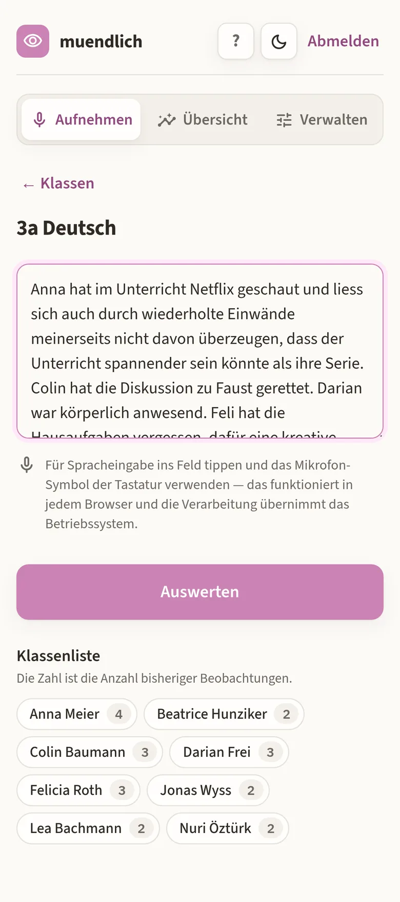
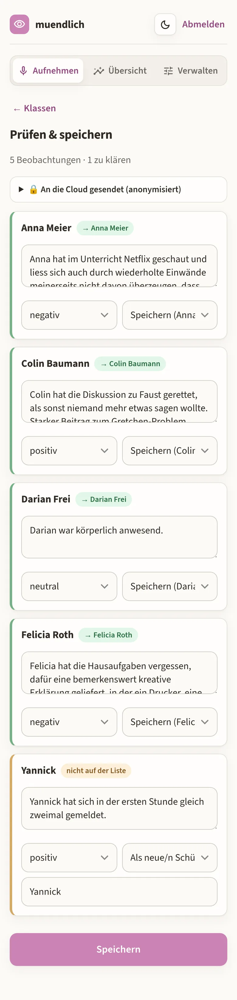

# muendlich

Dictate what you noticed after a lesson; get it back as per-student observations.

Teachers have to award oral/participation marks across a whole semester but
almost never have a free minute between lessons to write anything down.
**muendlich** is a self-hosted PWA for that gap: after a lesson you open your
phone, pick the class, and talk — *"Anna watched Netflix again, Colin rescued the
Faust discussion, Darian was physically present"*. The app splits that into
separate observations, attaches each to the right pupil, tags a sentiment, and
files it. Over a semester those notes become the evidence base for a fair mark.

The UI and the teacher handbook are in German; the code and docs are in English.

<table>
<tr>
<td width="50%"></td>
<td width="50%"></td>
</tr>
<tr>
<td>Talk (or type) freely, one class at a time.</td>
<td>Check the split before it is saved. Off-roster names become a prompt, not a guess.</td>
</tr>
</table>

## How a capture is processed

```
dictation ─► [1] pseudonymize  ─► [2] structure ─► [3] resolve names ─► draft ─► you confirm ─► DB
             locally, on your     LLM, sees only    deterministic,
             server               placeholders      on your server
```

1. **Pseudonymize (local).** Pupil names are replaced with `Student1`, `Person1`,
   `Ort1` before anything leaves the machine — roster and alias matching
   (rapidfuzz + Kölner Phonetik), a German/Swiss first-name gazetteer, and spaCy
   `de_core_news_md` NER for people and places.
2. **Structure (cloud LLM).** Splits the monologue into observations and tags
   sentiment. It never sees a real name. Forced tool-calling keeps the JSON
   schema-safe. A stub structurer is the default, so the whole app runs with no
   API key at all.
3. **Resolve (local).** Placeholders map back to real pupils deterministically in
   the backend — identical in stub and cloud modes.

Nothing is written until you confirm the draft, and the draft screen shows you
the exact text that was sent.

> **This is pseudonymization, not anonymization.** It removes *names*, but the
> *content* of a note ("the boy who broke his arm") can still identify someone —
> no substitution scheme fixes that. Under GDPR/DSG pseudonymized data is still
> personal data, so using this with real pupils needs a data processing agreement
> with your LLM provider and an entry in your processing register.

## Stack

| | |
|---|---|
| Backend | Python 3.11+, FastAPI, SQLAlchemy 2.0, Alembic |
| Database | PostgreSQL 16 in production, SQLite for local dev |
| Frontend | React 18 + Vite, installable PWA, German UI, on-device dictation |
| Auth | Argon2 passwords, short JWT access token, rotating refresh cookie |
| Structurer | Anthropic (default `claude-sonnet-4-6`) behind a `Structurer` interface, or the offline stub |
| Deploy | Docker Compose behind a TLS reverse proxy |

Multi-tenant: every query is scoped to the authenticated user, and cross-tenant
access returns 404 rather than 403.

## Run it locally

No Docker, no Postgres, no API key:

```bash
cd backend
python -m venv .venv && source .venv/bin/activate
pip install -e ".[dev]"
alembic upgrade head
python -m app.seed          # dev admin + demo class — refuses to run in production
COOKIE_SECURE=false uvicorn app.main:app --reload
```

```bash
cd frontend && npm install && npm run dev
```

Then open <http://localhost:5173> and log in as `admin@example.com` /
`changeme-dev-only`. API docs are at <http://localhost:8000/docs>.

Tests: `pytest -q` in `backend/` (144 tests), plus `ruff check .`.

## Layout

| Path | |
|---|---|
| [`backend/`](backend/) | FastAPI app, migrations, tests — [setup and configuration](backend/README.md) |
| [`frontend/`](frontend/) | React PWA |
| [`deploy/`](deploy/) | Production Compose stack — [deployment walkthrough](deploy/README.md) |
| [`docs/handbuch.html`](docs/handbuch.html) | Teacher handbook (German), self-contained; generator in `docs/handbook-src/` |
| [`REQUIREMENTS.md`](REQUIREMENTS.md) | What it has to do and why |
| [`TECHNICAL_DESIGN.md`](TECHNICAL_DESIGN.md) | Data model, API surface, design decisions |

## Deploying

See [deploy/README.md](deploy/README.md). Postgres + backend + an internal nginx,
behind whatever TLS terminator you already run. HTTPS is not optional — browsers
will not give the app a microphone without it.

Accounts are created by an admin from the server (`python -m app.create_admin`);
there is no self-signup. Verbatim dictations are deleted at commit time, and a
purge job handles abandoned captures and expired tokens on a retention window.

## Demo account

Optional, off by default. With `DEMO_ENABLED=true`, a single shareable
address (`DEMO_EMAIL` / `DEMO_PASSWORD`) lets anyone try the app — but it is not
a shared login. Each visitor gets a **private throwaway account** seeded with the
same sample class, kept for 30 minutes and then deleted with everything in it.

That is deliberately not the obvious design. Sharing one real account would mean
serializing visitors behind a lock and rebuilding its data after each one; both
break down because people close the tab instead of logging out, which leaves the
lock held and the reset unrun. Handing out disposable accounts removes the lock
and the reset step: visitors cannot collide, and "fresh data" is simply what a
new account is. Cleanup runs on a timer, not on an event nobody triggers.

Spending is capped separately, since the demo calls a paid model: per input
length, per visitor, and — durably, so a restart cannot reset it — across all
visitors per day. Details and the cron entry are in
[deploy/README.md](deploy/README.md#demo-account).

## Status

Built for a single teacher and a handful of colleagues (~10 users), and used in
that setting. It is not a gradebook, not student- or parent-facing, and does not
integrate with school administration systems.

## License

[GNU General Public License v3.0](LICENSE).
